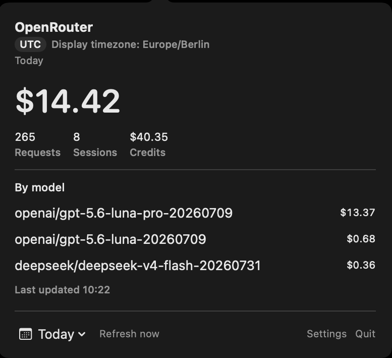
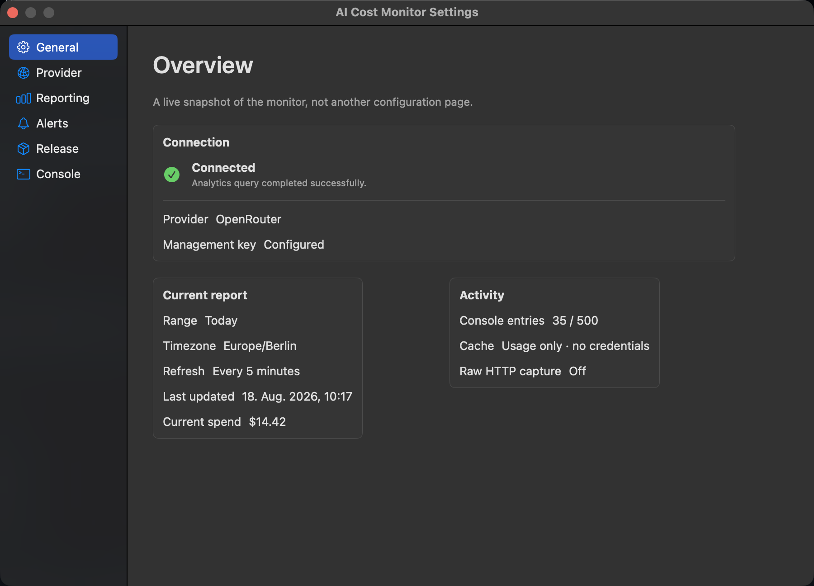

# AI Cost Monitor

<p align="center">
  <a href="https://github.com/LukaAsceric/macos-ai-cost-monitor/releases">
    
  </a>
</p>

<p align="center">
  <a href="https://github.com/LukaAsceric/macos-ai-cost-monitor/releases/latest">
    
  </a>
  <a href="https://github.com/LukaAsceric/macos-ai-cost-monitor/actions/workflows/ci.yml">
    
  </a>
  <a href="LICENSE">
    
  </a>
</p>

[](https://github.com/LukaAsceric/macos-ai-cost-monitor/releases)

[](https://github.com/LukaAsceric/macos-ai-cost-monitor/releases)

macOS menu-bar monitoring for OpenRouter AI spend.

AI Cost Monitor keeps current spend, request/session counts, remaining credits, and model-level usage one click away. It uses OpenRouter Analytics and stores the management key in the macOS Keychain.

## Installation

### Manual

Download the latest release from the [Releases](https://github.com/LukaAsceric/macos-ai-cost-monitor/releases) page.

1. Download the **DMG** or **ZIP** archive.
2. Open the DMG and drag `MacOSAICostMonitor.app` to `Applications`, or extract the ZIP and move the app there.
3. On first launch, public preview builds may show an unidentified-developer warning because they are ad-hoc signed. Control-click the app, choose **Open**, and confirm. If needed, use **System Settings → Privacy & Security → Open Anyway**.
4. Open **Settings → Provider** and add an OpenRouter management key.

`SHA256SUMS.txt` contains SHA-256 checksums for both installers.

### Requirements

- macOS 13 Ventura or later
- Apple Silicon or Intel Mac
- OpenRouter management API key with analytics/activity access

### Security

The management key is stored in the macOS Keychain. It is not included in the app, DMG, ZIP, logs, cache, or release artifacts.

### Build locally

```bash
swift build
swift test
bash Scripts/build-app.sh
open dist/MacOSAICostMonitor.app
```

Use the signed `.app` for normal operation. `swift run` can change the development executable identity and cause repeated Keychain prompts.

## Features

- Menu-bar popover with current spend and sparkline
- Requests, Sessions, and remaining Credits in the headline
- Per-model cost breakdown with optional provider grouping
- Configurable menu-bar time-range list; new installations start with `Today`
- The last selected report range is restored between launches
- Display timezone, refresh interval, decimal precision, and custom ranges
- Local budget threshold with optional macOS notification
- Sanitized in-memory console with optional raw HTTP capture
- Signed Sparkle updates with configurable automatic download/install
- Universal Apple Silicon and Intel app bundle

## Settings

### General

The General page is an operational overview of the current connection, selected report, last refresh, and local activity. `Current report` and `Activity` are shown side by side.

### Provider

OpenRouter is currently supported. Other providers remain visible as disabled catalogue entries for future integrations.

### Reporting

The **Menu-bar dialog ranges** card controls which ranges appear in the popover. The selected report itself is changed from the popover calendar menu. New installations default to `Today`; after the first selection, the last chosen range is restored.

Calendar ranges use the selected display timezone. Analytics requests use an explicit `time_range` and matching granularity.

### Alerts

Configure a local budget threshold and optional macOS notifications. Notifications do not contact OpenRouter.

### Release

Packaged releases use Sparkle 2.9.6 with EdDSA-signed appcasts hosted on GitHub Releases. Update checks run over HTTPS, and Sparkle verifies the signed feed and update archive before installation.

The **Automatic updates** setting controls whether Sparkle may download and install signed updates automatically. Manual **Check for Updates…** remains available when the packaged app has a valid Sparkle configuration.

### Console

Use the Console page to filter, copy, clear, and export sanitized diagnostics. Raw HTTP response capture is disabled by default and is kept in memory only when explicitly enabled.

## OpenRouter Analytics

The live dashboard queries:

```text
POST https://openrouter.ai/api/v1/analytics/query
```

A management key is required. Regular inference keys and OpenRouter OAuth PKCE keys do not provide the required analytics access.

The app also uses `GET /api/v1/credits` for the remaining Credits headline and an analytics session query for the Sessions count. Sessionless requests are excluded from the session count.

## Updates

Release appcasts are signed with Sparkle EdDSA keys and hosted on GitHub Releases. Direct `swift run` binaries and unsigned preview builds keep update controls unavailable because they do not have the required app bundle identity and public key.

The release workflow requires these GitHub Actions secrets:

- `SPARKLE_PUBLIC_ED_KEY` — public key embedded into the packaged app
- `SPARKLE_EDDSA_PRIVATE_KEY` — private key used only by the release workflow to sign appcasts and update archives

Never commit the private key. Generate the key pair with Sparkle's `generate_keys` tool on macOS, store the private value as a GitHub Actions secret, and keep only the public value in the release configuration.

## Troubleshooting

- **401:** the management key was rejected or revoked.
- **403:** the key is not a management key or lacks analytics access.
- **429:** OpenRouter rate-limited the request.
- **No update controls:** launch a packaged `.app` with a signed Sparkle configuration, not `swift run`.
- **Repeated Keychain prompts:** launch `dist/MacOSAICostMonitor.app`, not `swift run`.
- **No current-day data:** OpenRouter Analytics may not publish the current completed UTC bucket yet; the app preserves the last successful value where possible.

## Development

The repository can be edited on Linux, but AppKit, SwiftUI, Keychain, `swift test`, `iconutil`, and `.app` verification must be run on macOS.

```bash
git clone https://github.com/LukaAsceric/macos-ai-cost-monitor.git
cd macos-ai-cost-monitor
swift test
```

## License

[MIT License](LICENSE)

## Reference

README structure and presentation are inspired by [Stats](https://github.com/exelban/stats), a macOS menu-bar system monitor.
